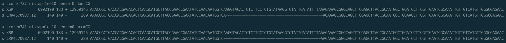

```{r setup, include=FALSE}
knitr::opts_chunk$set(echo = TRUE)
library(ggplot2)
library(dplyr)
```

## Data
#### Assembled Genome:
biohazard:~mcfrith/proj/oikopleura/raw/OKI2018_I69_1.0_alignments_with_different_parameters/copy_of_the_genomes/OKI2018_I69_1.0.removed_chrUn.fa

#### RNA-Seq reads:
https://www.ncbi.nlm.nih.gov/sra/?term=PRJEB40135

RNA extracted from

- a pool of embryos 
- a pool of immature adults
- a pool of matured adults

## Alignment
#### LAST commands:
lastdb OikopleuraDB /path/to/OKI2018_I69_1.0.removed_chrUn.fa

last-train -Q0 OikopleuraDB /path/to/RNA-Seq.fastq > trainOikopleura.out

lastal -D10 -p trainOikopleura.out OikopleuraDB /path/to/RNA-Seq.fastq | last-split -d2 -g OikopleuraDB > lastsplitOikopleura.out

## Deletions
There are relatively large deletions in the alignments between the genome and RNA-seq reads.


<span style="color: blue;">LAST-SPLIT may report introns as large deletions. Giving intron distribution info as options to LAST-SPLIT may change the results. </span>

```{r deletion, echo=FALSE}
deletionData_embryos <- read.table("~/biohazard/oikopleura/analysis/data/embryos/deletionLengthDistribution_lastsplitOKI2018_I69_1.0_ERR4570985.txt")
deletionData_immatureAdults <- read.table("~/biohazard/oikopleura/analysis/data/immatureAdults/deletionLengthDistribution_lastsplitOKI2018_I69_1.0_ERR4570986.txt")
deletionData_maturedAdults <- read.table("~/biohazard/oikopleura/analysis/data/maturedAdults/deletionLengthDistribution_lastsplitOKI2018_I69_10_ERR4570987.txt")

hist(deletionData_embryos$V1, main="Histgram of deletion length in embryos", xlab="deletion length")
hist(deletionData_immatureAdults$V1, main="Histgram of deletion length in immature adults", xlab="deletion length")
hist(deletionData_maturedAdults$V1, main="Histgram of deletion length in matured adults", xlab = "deletion length")

```

## Splicing Signals

I read output .MAF files of LAST-SPLIT, looked 'don' and 'acc' fields, and extracted donor-and-acceptor pairs.

I discarded data whose donor-and-acceptor pairs are unknown. (When both ends of the read are unaligned, it's impossible to tell the donor-and-acceptor pairs from .MAF file). 


```{r splicingSignals_FileReading, echo=FALSE}
ss_embryos <- read.table(file='~/biohazard/oikopleura/analysis/data/embryos/splicingSignalsDistExactSplicings_embryos.tsv', sep='\t', header=T)
ss_immature <- read.table(file='~/biohazard/oikopleura/analysis/data/immatureAdults/splicingSignalsDistOfExactSplicings_immature.tsv', sep='\t', header=T)
ss_matured <- read.table(file='~/biohazard/oikopleura/analysis/data/maturedAdults/splicingSignalsDistOfExactSplicings_matured.tsv', sep='\t', header=T)
```
The number of splicing signals detected are

- embryos: `r nrow(ss_embryos)`
- immature adults: `r nrow(ss_immature)`
- matured adults: `r nrow(ss_matured)`

I arbitrary extracted splicing signals with >= 180,000 counts.
```{r splicingSignals_ggplot_echo, echo=FALSE}
# --- embryos ----
g_ss_embryos <- ss_embryos %>% mutate(donor_acceptor=paste(!!!rlang::syms(c('donor', 'acceptor')), sep='_')) %>% 
  subset(count >= 180000) %>% 
  ggplot(aes(x=reorder(x=donor_acceptor, X=count),  y=count, label=scales::comma(count))) + 
  geom_bar(stat='identity') + 
  coord_flip() + 
  labs(x='donor_acceptor') + 
  geom_text(hjust=-0.1) +
  labs(title='embryos')
#+ scale_x_continuous(limits=seq(0,7000000))
plot(g_ss_embryos)

# --- immature ----
g_ss_immature <- ss_immature %>% 
  mutate(donor_acceptor=paste(!!!rlang::syms(c('donor', 'acceptor')), sep='_')) %>% 
  subset(count >= 180000) %>%
  ggplot(aes(x=reorder(x=donor_acceptor, X=count),  y=count, label=scales::comma(count))) + 
  geom_bar(stat='identity') + 
  coord_flip() + 
  labs(x='donor_acceptor') + 
  geom_text(hjust=-0.1) +
  labs(title = 'immature adults')
plot(g_ss_immature)

# --- matured ----
g_ss_matured <- ss_matured %>% mutate(donor_acceptor=paste(!!!rlang::syms(c('donor', 'acceptor')), sep='_')) %>% 
  subset(count >= 180000) %>% 
  ggplot(aes(x=reorder(x=donor_acceptor, X=count),  y=count, label=scales::comma(count))) + 
  geom_bar(stat='identity') + 
  coord_flip() + 
  labs(x='donor_acceptor') + 
  geom_text(hjust=-0.1) +
  labs(title = 'matured adults')
plot(g_ss_matured)
```
```{r echo=FALSE}
ss_embryos_ordered <- ss_embryos[order(ss_embryos$count, decreasing=TRUE),]
ss_immature_ordered <- ss_immature[order(ss_immature$count, decreasing=TRUE),]
ss_matured_ordered <- ss_matured[order(ss_matured$count, decreasing=TRUE),]

all_ss_embryos <- sum(ss_embryos$count)
canonical_ss_embryos <- sum(ss_embryos_ordered[1:2,]$count)
non_canonical_ss_embryos <- all_ss_embryos - canonical_ss_embryos

all_ss_immature <- sum(ss_immature$count)
canonical_ss_immature <- sum(ss_immature_ordered[1:2,]$count)
non_canonical_ss_immature <- all_ss_immature - canonical_ss_immature

all_ss_matured <- sum(ss_matured$count)
canonical_ss_matured <- sum(ss_matured_ordered[1:2,]$count)
non_canonical_ss_matured <- all_ss_matured - canonical_ss_matured

```
The number of GT_AG splicing signals

- embryos: `r ss_embryos_ordered[1,]$count`
- immature adults: `r ss_immature_ordered[1,]$count`
- mature adults: `r ss_matured_ordered[1,]$count`

The percentage of non-canonical (non GT_AG, CT_AC) splicing signals

- embryos:`r non_canonical_ss_embryos / all_ss_embryos * 100` %
- immature adults: `r non_canonical_ss_immature / all_ss_embryos * 100` %
- matured adults: `r non_canonical_ss_matured / all_ss_matured * 100` %

<span style="color: blue;">There may be many canonical introns reported as large deletions. Pre-processing reads may also change the results.</span>